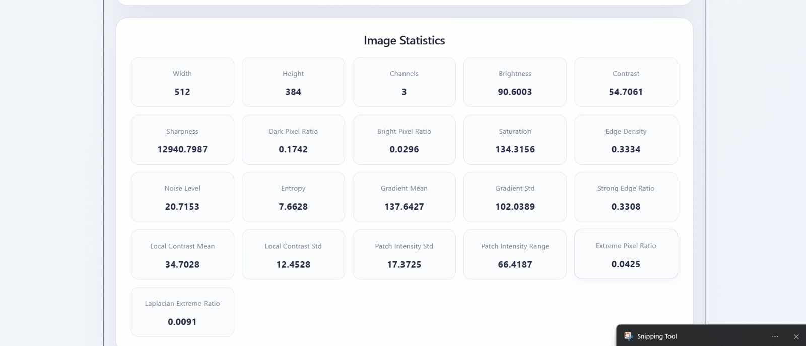
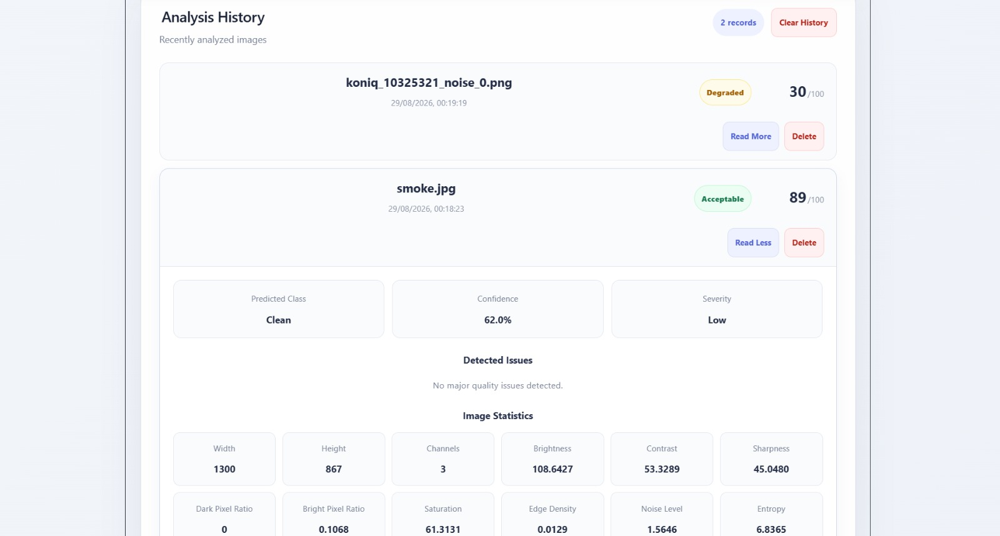
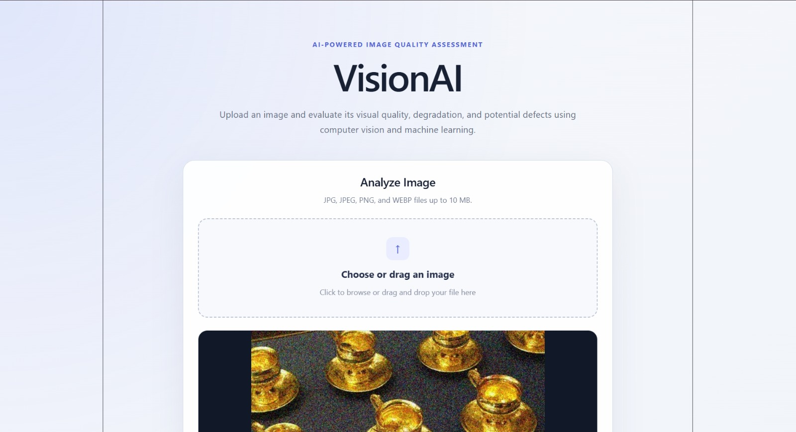
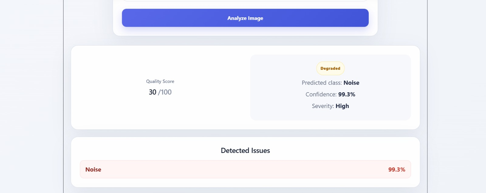

# VisionAI

## AI-Powered Image Quality & Defect Detection 

**Computer Vision + Machine Learning | FastAPI | React | SQLite | Docker**

VisionAI is a full-stack AI application for automated image-quality assessment and conservative visual defect detection.

The system accepts an uploaded image, extracts interpretable computer-vision features, applies a locally trained machine-learning model, and returns:

- Quality score
- Quality label
- Predicted quality class
- Confidence
- Severity
- Detected quality issues
- Image statistics
- Analysis history

VisionAI combines **Computer Vision + Machine Learning** rather than relying only on fixed image-processing thresholds.

All image processing and machine-learning inference are performed locally.

**No external AI/vision API or API key is required.**

---

## Key Results

| Item | Result |
|---|---:|
| Global quality classes | 6 |
| Engineered CV features | 18 |
| Held-out test samples | 324 |
| Accuracy | **88.89%** |
| Balanced Accuracy | **88.89%** |
| Macro F1 | **88.68%** |
| Weighted F1 | **88.68%** |
| Primary model | Random Forest |
| External AI APIs | None |
| Deployment | Docker Compose |

The six global quality classes are:

```text
blur
clean
degraded
noise
overexposed
underexposed
```

Potential localized defects are handled separately through a conservative anomaly-warning mechanism described later in this README.

---

# Quick Start — Run & Test VisionAI

Docker Compose is the recommended way to evaluate the complete project.

## Prerequisites

Install:

- Git
- Docker Desktop

Docker Desktop includes Docker Compose on supported installations.

---

## 1. Clone the Repository

```bash
git clone https://github.com/Abhinaya-Nalivela/VisionAI.git
cd VisionAI
```

---

## 2. Build the Application

```bash
docker compose build
```

This builds:

- FastAPI backend
- React/Vite frontend
- Python ML runtime
- Trained Random Forest model inside the backend image

---

## 3. Start the Application

```bash
docker compose up
```

Wait until the frontend and backend containers are running.

---

## 4. Open the Application

### Frontend

```text
http://localhost:5173
```

### Backend

```text
http://localhost:8001
```

### FastAPI Interactive Documentation

```text
http://localhost:8001/docs
```

### Health Check

```text
http://localhost:8001/health
```

Expected response:

```json
{
  "status": "ok",
  "service": "VisionAI API",
  "version": "1.0.0"
}
```

---

## 5. Test the Application

Representative test images are included in:

```text
sample_images/
```

Available examples:

```text
clean.jpg
blur.jpg
underexposed.jpg
overexposed.jpg
noise.jpg
degraded.jpg
```

To test through the frontend:

1. Open `http://localhost:5173`
2. Select or drag an image from `sample_images/`
3. Preview the selected image
4. Click **Analyze Image**
5. Review the quality score, label, confidence, severity, issues, and statistics
6. View the saved result in **Analysis History**

---

## 6. Stop the Application

Press `Ctrl+C` if Compose is running in the foreground, then run:

```bash
docker compose down
```

Analysis history is stored in a persistent Docker volume and survives normal container recreation.

> `docker compose down -v` removes the database volume and its stored history.

---

# System Architecture

```text
+----------------------+
|        USER          |
+----------+-----------+
           |
           | Upload Image
           v
+----------------------+
|    React Frontend    |
|     Port 5173        |
|                      |
| Upload / Preview     |
| Results / History    |
+----------+-----------+
           |
           | REST API
           v
+----------------------+
|    FastAPI Backend   |
|      Port 8001       |
+----------+-----------+
           |
           v
+----------------------+
| Input Validation &   |
| Image Decoding       |
+----------+-----------+
           |
      +----+----+
      |         |
      v         v
+-----------+  +-------------+
| Computer  |  | Random      |
| Vision    |  | Forest      |
| Features  |  | ML Model    |
+-----+-----+  +------+------+
      |               |
      +-------+-------+
              |
              v
+----------------------+
|   Decision Engine    |
|                      |
| ML Prediction        |
| + CV Evidence        |
| + Local Anomaly      |
+----------+-----------+
           |
           v
+----------------------+
| Structured Result    |
|                      |
| Score / Label        |
| Confidence           |
| Severity / Issues    |
| Statistics           |
+----------+-----------+
           |
      +----+----+
      |         |
      v         v
+-----------+  +-------------+
| React     |  | SQLite      |
| Results   |  | History     |
+-----------+  +-------------+
```

The **Random Forest model is the primary learned global quality classifier**.

Computer-vision measurements provide interpretable input features and supporting evidence for the final decision.

---

# Technology Stack

| Layer | Technologies |
|---|---|
| Frontend | React, Vite, JavaScript, CSS |
| Backend | Python 3.12, FastAPI, Uvicorn |
| Computer Vision | OpenCV, Pillow, NumPy |
| Machine Learning | scikit-learn, Random Forest, Joblib, pandas |
| Database | SQLite, SQLAlchemy |
| Deployment | Docker, Docker Compose |
| Testing | pytest |

---

# Features

VisionAI supports:

- Image upload and preview
- Drag-and-drop upload
- JPG, JPEG, PNG, and WEBP images
- Maximum upload size of 10 MB
- AI-based image-quality classification
- Blur detection
- Underexposure detection
- Overexposure detection
- Noise detection
- Severe degradation detection
- Conservative potential visual-defect detection
- Quality score from 0 to 100
- Confidence score
- Severity level
- Detected issues
- Explainable image statistics
- Persistent analysis history
- Expandable history details
- Individual history-record deletion
- Clear History functionality
- REST API
- Health endpoint
- Docker deployment
- Automated backend validation tests

Possible final labels are:

```text
ACCEPTABLE
DEGRADED
POTENTIALLY_DEFECTIVE
```

---

---

# Application Preview

The following screenshots demonstrate the working VisionAI application, including image upload, AI-based quality analysis, detailed results, and persisted analysis history.

## Image Analysis




The analysis interface displays the uploaded image together with the predicted quality class, overall quality score, confidence, severity, detected issues, and interpretable image statistics.

## Analysis History



Previous analyses are persisted in SQLite and can be reviewed, expanded, individually deleted, or cleared from the interface.

## Upload Interface





Users can upload or drag and drop a supported image, preview it, and start the quality analysis directly from the web interface.

---

# AI / ML Approach

VisionAI uses a hybrid approach:

```text
Image
  |
  v
Computer Vision Feature Extraction
  |
  v
18 Engineered Features
  |
  v
Random Forest Classifier
  |
  +----------------------+
  |                      |
  v                      v
Global Prediction    Supporting CV /
                     Local Anomaly
  |                      |
  +----------+-----------+
             |
             v
       Final Decision
```

The learned Random Forest model is responsible for the primary global image-quality prediction.

Computer-vision processing is used to:

- Generate interpretable ML input features
- Measure image characteristics
- Provide supporting degradation evidence
- Expose useful statistics to the user
- Conservatively identify unusual localized regions

This ensures that the final assessment meaningfully uses a **trained machine-learning model** rather than relying only on manually selected thresholds.

---

# Why Random Forest?

The model operates on engineered numerical image-quality features instead of raw image pixels.

Random Forest was selected because it:

- Performs effectively on tabular numerical features
- Learns nonlinear relationships between features
- Works with a relatively modest training dataset
- Provides feature-importance information
- Supports fast inference
- Does not require GPU hardware
- Is lightweight to deploy
- Supports deterministic and reproducible training

This provides a practical balance between:

**ML capability + explainability + deployment simplicity**

A large deep-learning architecture was not necessary for this assessment because the objective can be addressed effectively using interpretable CV features combined with a learned classifier.

---

# Computer Vision Features

The final global classifier uses **18 engineered image-quality features**.

## Brightness and Exposure

- Brightness
- Dark pixel ratio
- Bright pixel ratio
- Extreme pixel ratio

## Sharpness and Gradients

- Sharpness
- Gradient mean
- Gradient standard deviation
- Strong edge ratio
- Laplacian extreme ratio

## Contrast

- Contrast
- Local contrast mean
- Local contrast standard deviation

## Noise and Texture

- Noise level
- Entropy
- Edge density

## Local Intensity

- Patch intensity standard deviation
- Patch intensity range

## Color

- Saturation

The API additionally reports image:

- Width
- Height
- Channel count

These measurements improve result interpretability.

---

# Dataset

The data-preparation workflow combines:

- **250 high-quality images** selected from the public KonIQ-10k image-quality dataset
- **20 additional source images**
- Controlled synthetic degradation generation

Total source images:

```text
250 KonIQ images
+ 20 additional images
----------------------
270 source images
```

KonIQ subset-selection metadata is stored in:

```text
backend/dataset/koniq_selection.csv
```

The additional source images are stored in:

```text
backend/dataset/source/
```

Large generated datasets and the local KonIQ working-image directory are intentionally excluded from Git to keep the repository lightweight.

The scripts required to reproduce the preparation and degradation workflow are included under:

```text
backend/ml/
```

---

# Synthetic Degradation Generation

Controlled transformations were used to create known image-quality conditions.

Generated categories include:

- Clean
- Blur
- Underexposed
- Overexposed
- Noise
- Degraded
- Synthetic visual defect

The final global model is trained on six classes:

```text
blur
clean
degraded
noise
overexposed
underexposed
```

Synthetic degradation provides known labels while allowing controlled evaluation of common image-quality problems.

Dataset generation is implemented in:

```text
backend/ml/generate_dataset.py
```

---

# Train/Test Separation

The dataset is split at the **source-image level before synthetic degradations are generated**.

This is important because it prevents degraded versions of the same original image from appearing in both the training and testing sets.

The deterministic split uses:

```text
Random seed:       42

Total sources:     270
Training sources:  216
Testing sources:    54
```

For the final six-class global model:

```text
Training samples: 1296
Testing samples:   324

Training samples per class: 216
Testing samples per class:   54
```

The held-out test degradations therefore originate from **source images unseen during training**.

This reduces source-level leakage and provides a more meaningful generalization test.

---

# Model Training

The final global classifier is a Random Forest configured with:

```text
Estimators:          300
Random state:        42
Class weighting:     balanced
Parallel processing: enabled
```

Training script:

```text
backend/ml/train.py
```

Final model:

```text
backend/artifacts/quality_model_6class.joblib
```

Feature metadata:

```text
backend/artifacts/feature_metadata_6class.json
```

Evaluation report:

```text
backend/artifacts/evaluation_report_6class.txt
```

---

# Model Evaluation

The final six-class model was evaluated using:

```text
324 held-out test samples
```

generated from the **54 source images that were excluded from training**.

## Overall Metrics

| Metric | Result |
|---|---:|
| Accuracy | **88.89%** |
| Balanced Accuracy | **88.89%** |
| Macro F1 | **88.68%** |
| Weighted F1 | **88.68%** |

## Per-Class Results

| Class | Precision | Recall | F1 |
|---|---:|---:|---:|
| Blur | 94.55% | 96.30% | 95.41% |
| Clean | 84.09% | 68.52% | 75.51% |
| Degraded | 94.44% | 94.44% | 94.44% |
| Noise | 85.45% | 87.04% | 86.24% |
| Overexposed | 81.36% | 88.89% | 84.96% |
| Underexposed | 92.98% | 98.15% | 95.50% |

The strongest performance is observed for:

- Blur
- Severe degradation
- Underexposure

The clean class is more challenging because some moderately degraded images can have feature distributions similar to otherwise acceptable images.

---

# Feature Importance and Explainability

Random Forest feature importance provides insight into which image characteristics contribute strongly to classification.

Some of the strongest learned features include:

```text
Sharpness
Laplacian Extreme Ratio
Bright Pixel Ratio
Noise Level
Gradient Standard Deviation
```

These correspond to meaningful image characteristics such as:

- Focus
- Exposure
- Noise
- Edge structure
- High-frequency detail

The frontend additionally displays:

- Quality score
- Quality label
- Predicted class
- Confidence
- Severity
- Detected issues
- Image statistics

This provides more interpretability than returning only a predicted class.

---

# Potential Visual Defect Detection

Localized visual defects were investigated separately from global quality degradation.

Two experimental approaches were evaluated:

1. Patch-based local anomaly scoring
2. Binary Random Forest defect classification using global and localized features

The patch-based approach produced limited held-out defect recall.

The experimental binary Random Forest detected some defects but generated too many false positives on clean images.

Because these approaches did not generalize reliably enough, they were **not promoted to the primary AI classifier**.

The final application therefore keeps localized anomaly information as a **conservative supporting warning signal**.

A potential defect warning is considered only when:

- The global model strongly considers the image clean
- No strong global degradation signal exists
- Local anomaly evidence is unusually high

> Potential visual-defect detection should therefore be interpreted as a conservative localized anomaly warning rather than a fully validated industrial defect classifier.

Experimental evaluation reports are retained at:

```text
backend/artifacts/local_defect_evaluation.txt
backend/artifacts/defect_binary_evaluation.txt
```

Keeping these experiments in the repository documents both successful and unsuccessful modelling approaches instead of hiding negative evaluation results.

---

# Final Decision Logic

The final decision follows four cases.

## 1. ML-Detected Degradation

If the Random Forest predicts:

```text
blur
underexposed
overexposed
noise
degraded
```

the final label is:

```text
DEGRADED
```

The Random Forest remains the primary decision source for these global quality conditions.

---

## 2. Strong CV Evidence

If the ML model predicts clean but very strong computer-vision evidence indicates a global quality problem, the system can override the clean prediction and return:

```text
DEGRADED
```

This acts as a conservative supporting safety rule.

---

## 3. Conservative Localized Anomaly

If the image:

- Is strongly predicted as globally clean
- Has no strong global degradation evidence
- Contains unusually strong localized anomaly evidence

the system may return:

```text
POTENTIALLY_DEFECTIVE
```

---

## 4. Acceptable

Otherwise:

```text
ACCEPTABLE
```

The trained Random Forest therefore remains the **primary learned global decision mechanism**, while CV and local anomaly measurements act as supporting evidence.

---

# REST API

The backend is implemented using FastAPI.

Base address:

```text
http://localhost:8001
```

Interactive documentation:

```text
http://localhost:8001/docs
```

---

## Health Check

```http
GET /health
```

Example response:

```json
{
  "status": "ok",
  "service": "VisionAI API",
  "version": "1.0.0"
}
```

---

## Analyze Image

```http
POST /api/analyze
```

The endpoint accepts an image using multipart form data.

Example:

```bash
curl -X POST \
  -F "file=@sample_images/clean.jpg" \
  http://localhost:8001/api/analyze
```

Example response:

```json
{
  "filename": "clean.jpg",
  "quality_score": 99,
  "quality_label": "ACCEPTABLE",
  "predicted_class": "clean",
  "confidence": 0.9567,
  "severity": "LOW",
  "issues": [],
  "probabilities": {
    "blur": 0.0,
    "clean": 0.9567,
    "degraded": 0.0033,
    "noise": 0.0033,
    "overexposed": 0.0333,
    "underexposed": 0.0033
  },
  "image_statistics": {},
  "analysis_id": 1
}
```

---

## Analysis History

```http
GET /api/history
```

Optional result limit:

```text
/api/history?limit=20
```

---

## Delete a History Record

```http
DELETE /api/history/{analysis_id}
```

---

## Clear History

```http
DELETE /api/history
```

All endpoints can also be explored and tested through:

```text
http://localhost:8001/docs
```

---

# Database and Persistence

VisionAI uses:

```text
SQLite + SQLAlchemy
```

Analysis records store information including:

- Filename
- Quality score
- Quality label
- Predicted class
- Confidence
- Severity
- Issues
- Model probabilities
- Image statistics
- Creation time

For normal local execution, SQLite automatically creates:

```text
backend/visionai.db
```

when the backend starts.

The runtime database is intentionally excluded from Git.

No external database server or manual database setup is required.

When using Docker Compose, the backend uses:

```text
DATABASE_PATH=/app/data/visionai.db
```

The database is stored in the Docker named volume:

```text
visionai_data
```

so analysis history survives normal container recreation.

---

# Model Loading and Inference After Deployment

The final trained Random Forest model is stored at:

```text
backend/artifacts/quality_model_6class.joblib
```

The artifact is included inside the backend Docker image.

When the FastAPI backend starts, the model service loads the serialized Joblib model and validates its expected feature configuration and classes.

For each uploaded image:

```text
Upload
  |
  v
Validate File
  |
  v
Decode Image
  |
  v
Extract 18 CV Features
  |
  v
Random Forest Inference
  |
  v
Class Probabilities
  |
  v
Supporting CV / Local Analysis
  |
  v
Final Quality Decision
  |
  v
Structured JSON
  |
  +------> React Frontend
  |
  `------> SQLite History
```

No model retraining or model download is required after deployment.

No external AI service is contacted during inference.

---

# Sample Images

Representative examples are included in:

```text
sample_images/
```

| File | Condition |
|---|---|
| `clean.jpg` | Clean / acceptable |
| `blur.jpg` | Blur |
| `underexposed.jpg` | Underexposure |
| `overexposed.jpg` | Overexposure |
| `noise.jpg` | Noise |
| `degraded.jpg` | Severe degradation |

These files provide an examiner with a quick way to test different image-quality conditions immediately after deployment.

---

# Input Validation and Error Handling

Supported upload formats:

```text
JPG
JPEG
PNG
WEBP
```

Maximum upload size:

```text
10 MB
```

The API validates uploaded data before ML inference and handles:

- Unsupported formats
- Oversized uploads
- Invalid image data
- Unreadable images
- Missing history records
- Analysis failures

Appropriate HTTP status codes and structured error responses are returned.

---

# Automated Backend Tests

Basic automated validation is included under:

```text
backend/tests/
```

The current pytest tests validate:

- Computer-vision feature extraction on a real sample image
- Required engineered feature availability
- Model loading
- ML inference
- Expected model classes
- Confidence/probability ranges

Run the tests from the backend directory:

```bash
cd backend
python -m pytest -q
```

Expected current result:

```text
2 passed
```

The localized-anomaly evaluation script is retained separately because it performs experimental statistical analysis rather than a simple unit-test assertion.

Future test expansion could include:

- FastAPI integration tests
- Database endpoint tests
- React component tests
- End-to-end browser tests

---

# Project Structure

```text
VisionAI/
|
|-- backend/
|   |
|   |-- app/
|   |   |-- api/
|   |   |-- core/
|   |   |-- db/
|   |   |-- schemas/
|   |   `-- services/
|   |
|   |-- artifacts/
|   |   |-- quality_model_6class.joblib
|   |   |-- feature_metadata_6class.json
|   |   |-- evaluation_report_6class.txt
|   |   |-- local_defect_evaluation.txt
|   |   |-- defect_binary_evaluation.txt
|   |   |-- train_features.csv
|   |   `-- test_features.csv
|   |
|   |-- dataset/
|   |   |-- source/
|   |   `-- koniq_selection.csv
|   |
|   |-- ml/
|   |-- tests/
|   |-- uploads/
|   |-- requirements.txt
|   `-- .env.example
|
|-- frontend/
|   |-- public/
|   `-- src/
|       |-- assets/
|       |-- services/
|       |-- App.jsx
|       |-- App.css
|       `-- main.jsx
|
|-- docker/
|   |-- backend.Dockerfile
|   `-- frontend.Dockerfile
|
|-- sample_images/
|   |-- clean.jpg
|   |-- blur.jpg
|   |-- underexposed.jpg
|   |-- overexposed.jpg
|   |-- noise.jpg
|   `-- degraded.jpg
|
|-- docker-compose.yml
|-- README.md
|-- LICENSE
|-- .gitignore
`-- .dockerignore
```

> `backend/visionai.db` is created automatically during local execution and is intentionally not committed to the repository.

Generated degradation datasets and the local KonIQ working-image directory are also excluded from Git because they can be recreated using the included ML scripts.

---

# Reproducing the ML Pipeline

ML utilities are located in:

```text
backend/ml/
```

Main scripts:

| Script | Purpose |
|---|---|
| `prepare_koniq_subset.py` | Prepare the selected public-dataset subset |
| `generate_dataset.py` | Generate controlled image degradations |
| `build_features.py` | Extract the engineered model features |
| `train.py` | Train and evaluate the final six-class Random Forest |
| `evaluate_local_defect.py` | Evaluate localized anomaly detection |
| `train_defect_binary.py` | Evaluate the experimental binary defect classifier |

The final trained model is already committed to the repository.

Therefore, **retraining is not required to run or evaluate the application**.

The stored artifacts also allow the training and evaluation process to be inspected independently of runtime inference.

---

# Local Development — Optional

Docker Compose is the recommended evaluation method.

For development without Docker:

## Backend

From the project root, create a virtual environment:

```bash
python -m venv .venv
```

### Windows PowerShell

```powershell
.\.venv\Scripts\Activate.ps1
```

Install backend dependencies:

```bash
pip install -r backend/requirements.txt
```

Start the backend:

```bash
cd backend
uvicorn app.main:app --host 0.0.0.0 --port 8001
```

Backend:

```text
http://localhost:8001
```

API documentation:

```text
http://localhost:8001/docs
```

---

## Frontend

Open another terminal from the project root:

```bash
cd frontend
npm install
npm run dev
```

Then open:

```text
http://localhost:5173
```

---

# Known Limitations

VisionAI is a technical assessment project rather than a production industrial inspection platform.

Current limitations include:

- The global model is trained primarily using controlled synthetic degradations.
- Real-world distortion distributions may differ from the synthetic training distribution.
- The clean class is more difficult to distinguish than several degradation classes.
- Moderately overexposed images can occasionally overlap with clean feature distributions.
- Localized defect detection is conservative and experimental.
- Small or subtle defects may not trigger a potential-defect warning.
- Random Forest confidence values have not undergone dedicated probability calibration.
- Production-grade defect detection would require a larger real-world annotated defect dataset.

These limitations are intentionally documented to avoid overstating the model's capability.

---

# Reproducibility

The project supports reproducibility through:

- Fixed random seed (`42`)
- Source-level train/test separation
- Stored trained model
- Stored feature metadata
- Stored evaluation reports
- Stored training/testing feature tables
- Version-pinned Python dependencies
- Dataset-generation scripts
- Training scripts
- Dockerized backend and frontend
- Docker Compose configuration
- Automated backend tests
- Documented limitations and negative experimental results

Important artifacts include:

```text
backend/artifacts/quality_model_6class.joblib
backend/artifacts/feature_metadata_6class.json
backend/artifacts/evaluation_report_6class.txt
backend/artifacts/local_defect_evaluation.txt
backend/artifacts/defect_binary_evaluation.txt
backend/artifacts/train_features.csv
backend/artifacts/test_features.csv
```

---

# Privacy and External Services (Not Required)

VisionAI performs computer-vision processing and machine-learning inference locally.

The application does **not** require:

- OpenAI API
- Google Vision API
- AWS Rekognition
- Azure Computer Vision
- External LLM services
- Cloud-hosted AI inference

No external AI API key is required.

Uploaded images are processed by the application's own backend and local model.

---

# Deployment Status

The project is designed to run completely outside the original development environment through Docker Compose.

The repository includes:

```text
docker/backend.Dockerfile
docker/frontend.Dockerfile
docker-compose.yml
```

The Docker deployment provides:

- Frontend container
- Backend container
- Packaged trained model
- Environment-configurable SQLite path
- Persistent database volume
- Health endpoint
- Correct frontend/backend port exposure

Local Docker Compose deployment is the primary supported deployment method.

A public cloud URL is not required to run or evaluate the project.

---

# Assessment Coverage

VisionAI demonstrates an end-to-end implementation of:

```text
Image Upload
     |
     v
Computer Vision Feature Extraction
     |
     v
Machine Learning Classification
     |
     v
Explainable Quality Decision
     |
     v
FastAPI REST API
     |
     v
SQLite Persistence
     |
     v
React User Interface
     |
     v
Dockerized Deployment
```

The implementation prioritizes a **robust, explainable, reproducible, and lightweight solution** rather than unnecessary architectural complexity.

---

# Author

**Nalivela Abhinaya**

VisionAI — AI-Powered Image Quality & Defect Detection
